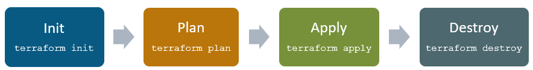
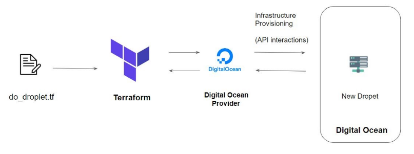
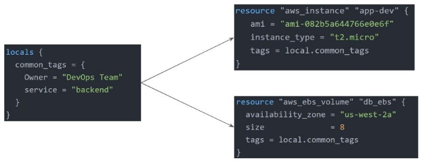
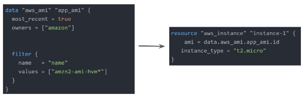
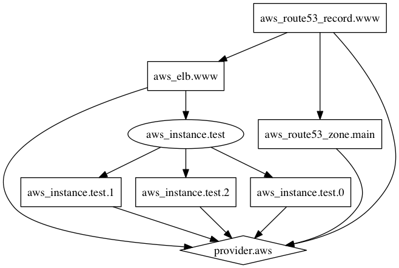

# Terraform 101

This document will explain [Terraform](https://www.terraform.io/) tool and its features on a high-level.

### **What is Iac?** 
Infrastructure as Code (IaC) automates the provisioning of infrastructure, enabling your organization to develop, deploy, and scale cloud applications with greater speed, less risk, and reduced cost. 

for more on Iac [click here](https://www.ibm.com/cloud/learn/infrastructure-as-code)

<br>
Before we see what is Terraform let's understand the difference between Configuration Management vs Infrastructure Orchestration

**Ansible**, **Chef**, **Puppet** are configuration management tools which means that they are primarily designed to install and manage software on existing servers.

**Terraform**, **AWS CloudFormation**, **Azure Resource Manager** are the infrastructure orchestration tools which basically means they can provision the servers and infrastructure by themselves.

I don't mean to say we cannot provision infra with configuration management tools, but the focus here is that some tools are going to be better fit for certain type of tasks.

### **What is Terraform?**
  
Terraform is a Infrastructure Orchestration tool developed by HashiCorp for **building, changing** and **versioning infrastructure** safely and efficiently. Terraform can manage existing and popular service providers as well as custom in-house solutions.

### Advantages to using Terraform

1. Supports multiple platforms and has hundreds of provides
2. Easy to learn
3. Free and open source

## Enough of intro let's get started

### **Installation**
To use Terraform you will need to install it. HashiCorp distributes Terraform as a [binary package](https://www.terraform.io/downloads.html). You can also install Terraform using popular package managers.

**Homebrew on MacOS**

```
brew tap hashicorp/tap

brew install hashicorp/tap/terraform
```

**Chocolatey on Windows**

```
choco install terraform
```

For Linux and manual installation [click here](https://learn.hashicorp.com/tutorials/terraform/install-cli)


### **Basic Commands**
These are the four main commands you will be using with Terraform the most. 



`terraform init` - The terraform init command is used to initialize a working directory containing Terraform configuration files. This is the first command that should be run after writing a new Terraform configuration

`terraform plan` - Terraform plan is used to create an execution plan to reach a desired state of the infrastructure. Changes in the configuration files are done in order to achieve the desired state.

`terraform apply` - Terraform apply then makes the changes in the infrastructure as defined in the plan, and the infrastructure comes to the desired state.

`terraform destroy` - Terraform destroy is used to delete all the old infrastructure resources, which are marked tainted after the apply phase.


*Yes there are other commands too.*

### **Terraform statefile**
Terraform stores the state of the infrastructure that is being created from the TF files.

This state allows terraform to map real-world resources to your existing configuration.
All metadata are stored in statefile

<!-- ### Terraform Refresh
will fetch current status -->

### **Provider versioning**
To understand provider versioning first lets understand provider and its architecture 



Terraform Provider is responsible to authenticate/interact with the service provider (in the above example Digital ocean), TF provider acts as a middle man between TF and Service provider.

whenever `terraform init` command is executed terraform will download appropriate provider plugin , these provider plugin are different from terraform configuration and they have different set of version.

*Example: version 3.0 and above will be used*
```sh
provider "aws" {
    region = "us-east-1"
    version = "~> 3.0" 
}
```

### **Attributes and Output**
Terraform has the capability to output the attribute of a resource with the output values.

*Example* 
```
ec2_public_ip      =  35.161.21.197
bucket_identifier = terraform-test-bkt.s3.amazonaws.com
```

An outputted attributes can not only be used for the user reference but it can also act as an input to other resources being created via terraform

### **Terraform variables**
Variables allows us to centrally define the values that can be used in multiple terraform configuration blocks.

Variables in Terraform can be assigned values in multiple ways.

Some of these include:

- Environment variables 
  ```sh
  export TF_VAR_instancetype="t2.nano"
  echo $TF_VAR
  ```
- Command Line Flags
  ```sh
  terraform plan -var="instancetype=t2.small"
  terraform plan -var-file="custom.tfvars"
  ```
- From a File `terraform.tfvars`
  ```sh
  instancetype="t2.large"
  ```
- Variable Defaults
  ```sh
  variable "instancetype" {
  default = "t2.micro"
  }
  ```

***Variables are important and vast topic to cover***

<!-- #### variable type -->

### **Count Parameter**
The count parameter on resources can simplify configurations and let you scale resources by simply incrementing a number.

Example: to create three EC2 instances
```
resource "aws_instance" "test-instance" {
    ami = "ami-489237brhf93ui4u123"
    instance_type = "t2.micro"
    count = 3
}
```
<!-- #### conditional expression -->

### **Local Value**
A local value assigns a name to an expression, allowing it to be used multiple times within a module without repeating it.

*Example: Tags are created as local value and refereed in resource block.*


### **Terraform Functions**
The Terraform language includes a number of built-in functions that you can use to transform and combine values.

The Terraform language does not support user-defined functions, and so only the functions built into the language are available for use

- Numeric
- String
- Collection
- Encoding
- Filesystem
- Date and Time
- Hash and Crypto
- IP Network
- Type Conversion

*Example*
```
> max(5, 12, 9)
12
```

### **Data Sources**
Data sources allow data to be fetched or computed for use elsewhere in Terraform configuration. A data source is defined under the data block. 

This example reads from a specific data source (aws_ami) and exports results under `app_ami`


### **Terraform Format**
As the name says Terraform Format will format\tailor your configuration file.
The `terraform fmt` command is used to rewrite Terraform configuration files to take care of the overall formatting

### **Dynamic Blocks**
In many of the use-cases, there are repeatable nested blocks that need to be defined.This can lead to a long code and it can be difficult to manage in a long time.

Dynamic Block allows us to dynamically construct repeatable nested blocks which is supported inside resource, data, provider, and provisioner blocks.

```
variable "sg_ports" {
  type        = list(number)
  description = "list of ingress ports"
  default     = [8200, 8201,8300, 9200, 9500]
}

resource "aws_security_group" "dynamicsg" {
  name        = "dynamic-sg"
  description = "Ingress for Vault"

  dynamic "ingress" {
    for_each = var.sg_ports
    iterator = port
    content {
      from_port   = port.value
      to_port     = port.value
      protocol    = "tcp"
      cidr_blocks = ["0.0.0.0/0"]
    }
  }

  dynamic "egress" {
    for_each = var.sg_ports
    content {
      from_port   = egress.value
      to_port     = egress.value
      protocol    = "tcp"
      cidr_blocks = ["0.0.0.0/0"]
    }
  }
}
```

### **Terraform Graph**
The terraform graph command is used to generate a visual representation of either a configuration or execution plan 

The output of terraform graph is in the DOT format, which can easily be converted to an image.



### **Provisioners**
Provisioners are used to execute scripts on a local or remote machine as part of resource creation or destruction.

*Example: On creation of Web-Server, execute a script which installs Nginx web-server.*

<!-- ### module -->

<!-- #### workspace -->

<!-- #### Remote Backend -->

<!-- #### TF import -->


> This document was created from my study material, it may not contain every aspect of Terraform. I will keep updating this study material at [GitHub](https://github.com/JAG-010/Terraform_101)

